# relop

[](https://github.com/SarthakMakhija/relop/actions/workflows/build.yml)
[](https://codecov.io/gh/SarthakMakhija/relop)


**relop** is a minimal, in-memory implementation of **relational operators** built to explore **query processing** - from lexical analysis and parsing to logical planning and execution.

The project intentionally focuses on a **small subset of SQL SELECT** and operates over **preloaded in-memory relations**, avoiding database concerns such as storage, persistence, transactions, or optimization.

**relop** is a learning-focused project inspired by relational algebra and database internals, not a production-ready query engine.

## Usage

`relop` provides a `Relop` client to interact with the system. You can define schemas, create tables, insert data, and run SQL queries.

```rust
use relop::catalog::Catalog;
use relop::client::Relop;
use relop::schema::Schema;
use relop::types::column_type::ColumnType;
use relop::storage::row::Row;
use relop::types::column_value::ColumnValue;
use relop::row;
use relop::schema;

fn main() {
    // 1. Initialize the system
    let relop = Relop::new(Catalog::new());

    // 2. Define Schema and Create Table
    let schema = schema!["id" => ColumnType::Int, "name" => ColumnType::Text].unwrap();
    relop.create_table("employees", schema).unwrap();

    // 3. Insert Data
    relop.insert_into("employees", row![1, "Alice"]).unwrap();

    // 4. Run SQL Query
    let query_result = relop.execute("SELECT id, name FROM employees").unwrap();
    let result_set = query_result.result_set().unwrap();
    
    // 5. Iterate Results
    for row_view_result in result_set.iterator().unwrap() {
      let row_view = row_view_result.unwrap();
      println!("Found employee: {:?}", row_view.column_value_by("name").unwrap().unwrap());
    }
}
```

## Architecture

The query processing pipeline follows a standard database architecture:

```mermaid
graph LR
    subgraph Input
    A[SQL Query]:::data
    end

    subgraph Processing
    A --> P1(Lexer):::proc
    P1 --> B[Tokens]:::data
    B --> P2(Parser):::proc
    P2 --> C[AST]:::data
    C --> P3(Planner):::proc
    P3 --> D[Logical Plan]:::data
    D --> P4(Optimizer):::proc
    P4 --> E[Optimized Logical Plan]:::data
    E --> P5(Physical Planner):::proc
    P5 --> F[Physical Plan]:::data
    F --> P6(Executor):::proc
    end

    subgraph Output
    P6 --> G[ResultSet]:::data
    end

    classDef data fill:#E1F5FE,stroke:#0277BD,stroke-width:2px,rx:5,ry:5;
    classDef proc fill:#FFF3E0,stroke:#EF6C00,stroke-width:2px,rx:10,ry:10;
```



### Pipeline Details

1.  **Lexer**: Tokenizes the raw SQL string.
  *   *Input*: `SELECT id FROM employees WHERE id = 1`
  *   *Output*: `[SELECT, IDENT("id"), FROM, IDENT("employees"), WHERE, IDENT("id"), EQUAL, NUMBER(1)]`
2.  **Parser**: Converts tokens into an **Abstract Syntax Tree (AST)**.
  *   *Output*: `Select { source: Table("employees"), projection: Columns(["id"]), selection: Expr(id = 1), ... }`
3.  **Logical Planner**: Transforms the AST into a tree of **Logical Operators**.
  *   *Output*: `Project(Filter(Scan("employees"), id = 1), ["id"])`
4.  <kbd>WIP</kbd> **Optimizer**: Optimizes the logical plan into an **Optimized Logical Plan**.   
  *   *Output*: `Project(Scan("employees", [predicate]), ["id"])`
5.  <kbd>WIP</kbd> **Physical Planner**: Maps the optimized logical plan into a **Physical Plan**.
  *   *Output*: `PhysicalProject(PhysicalScan("employees", [predicate]), ["id"])`
6.  **Executor**: Traverses the physical plan and constructs a **physical execution pipeline** using `ResultSet` iterators, which pull data on demand.

## Source Code Navigation

For those looking to dive into the implementation, here is a guide to the key components:

*   🚪 **Entrypoint**: [`Relop`](src/client/mod.rs) is the primary interface for interacting with the system.
*   📦 **Storage Engine**:
    *   [`Row`](src/storage/row.rs): Core data representation at rest.
    *   [`Batch`](src/storage/batch.rs): Efficient handling of data in-flight.
    *   [`TableStore`](src/storage/table_store.rs): The core storage mechanism for tables.
*   📂 **Metadata & Catalog**:
    *   [`Catalog`](src/catalog/mod.rs): Manages table definitions, entries, and metadata.
    *   [`Schema`](src/schema/mod.rs): Definitions for columns and types.
*   🔍 **Query Processing**:
    *   [`Lexer`](src/query/lexer/mod.rs): Tokenizes SQL queries into a stream of tokens.
    *   [`Parser`](src/query/parser/mod.rs): Converts tokens into an Abstract Syntax Tree (AST).
    *   [`AST`](src/query/parser/ast.rs): Defines the structure of the SQL Abstract Syntax Tree.
    *   [`Logical Planner`](src/query/plan/mod.rs): Transforms the AST into a tree of logical operators.
    *   [`Executor`](src/query/executor/mod.rs): Traverses the logical plan and constructs a physical execution pipeline.
    *   [`ResultSet`](src/query/executor/result_set.rs): An iterator-based interface for consuming query results.

## Testing

`relop` has a comprehensive test suite covering unit functionality and end-to-end integration.

To run all tests:

```bash
cargo test
```

## Goals Status

- [x] **Understand query processing**:
  - [x] Grammar
  - [x] Lexer
  - [x] Parser
  - [x] AST
  - [x] Logical plan
  - [x] Operator-based execution
- [x] **Implement core relational operators**:
  - [x] Scan
  - [x] Filter
  - [x] Projection
  - [x] Limit
  - [x] Order by
  - [x] Show tables
  - [x] Describe table
  - [x] Join (_nested-loop implementation_)
- [x] **Build a minimal in-memory store**:
  - [x] Tables with schemas
  - [x] Rows stored in memory (`SkipMap` based)
  - [x] Insert rows via API
  - [x] Sequential table scan
- [ ] Implement optimizer
    - [x] Predicate Pushdown for single table queries
    - [ ] Predicate Pushdown for join queries
    - [ ] Split conjunction
    - [ ] Choose the type of join algorithm
    - [ ] Choose the order of joining tables
- [ ] Implement physical plan

## Supported SQL

**relop** supports a curated subset of SQL `SELECT` statements, focusing on core relational operations.

### Basic Selection
*   `SELECT * FROM <table>`
*   `SELECT col1, col2 FROM <table>`

### Filtering (`WHERE`)
*   **Comparison**: `=`, `!=`, `>`, `>=`, `<`, `<=`
*   **Logical**: `AND`, `OR`
    *   `cond1 AND cond2` (Multi-condition support)
    *   `cond1 OR cond2`
    *   **Grouping**: `( ... )` (Parentheses override operator precedence)
    *   **Precedence**: `AND` binds tighter than `OR` (`A OR B AND C` is `A OR (B AND C)`).
*   **Pattern Matching**: `col LIKE <regular_expression>`

### Aggregation & Shaping
*   **Ordering**: `ORDER BY col1 [ASC|DESC], col2 [ASC|DESC]`
*   **Limiting**: `LIMIT <n>`
*   **Combined**: `WHERE ... ORDER BY ... LIMIT ...`

### Joins
*   **Inner Join**: Join tables based on matching columns.
    `SELECT * FROM users JOIN orders ON users.id = orders.user_id`
*   **Table Aliases**: Use short names to simplify queries.
    `SELECT * FROM users AS u JOIN orders AS o ON u.id = o.user_id`
*   **Multi-way Joins**: Link three or more tables together.
    `SELECT * FROM users JOIN orders ON users.id = orders.user_id JOIN line_items ON orders.id = line_items.order_id`
*   **Join with Filters**: Combine join conditions with additional filters.
    `SELECT * FROM users JOIN orders ON users.id = orders.user_id AND orders.status = 'shipped'`

### System Commands
*   `SHOW TABLES`: List all tables in the catalog.
*   `DESCRIBE TABLE <table>`: View column names and types for a specific table.

## Grammar

The SQL subset supported by `relop` is defined in [docs/grammar.ebnf](docs/grammar.ebnf).

The implementation details of the Join operator can be found in [docs/joins.md](docs/joins.md).

## Non-goals

- SQL `INSERT` / `CREATE TABLE` statements (these are handled via the API).
- Persistence or Disk I/O.
- Full SQL Compatibility.

## References

- [Crafting Interpreters](https://craftinginterpreters.com/contents.html)
  - Chapters 4,5,6
- [Database design and implementation](https://link.springer.com/book/10.1007/978-3-030-33836-7)
  - Chapter 10
