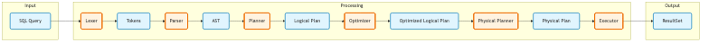

# relop

[](https://github.com/SarthakMakhija/relop/actions/workflows/build.yml)
[](https://codecov.io/gh/SarthakMakhija/relop)


**relop** is a minimal, in-memory implementation of **relational operators** built to explore **query processing** - from lexical analysis and parsing to logical planning and execution.

The project intentionally focuses on a **small subset of SQL SELECT** and operates over **pre-loaded in-memory relations**, avoiding database concerns such as storage, persistence, transactions, or optimization.

**relop** is a learning-focused project inspired by relational algebra and database internals, not a production-ready query engine.

## Usage

`relop` provides a `Relop` client to interact with the system. You can define schemas, create tables, insert data, and run SQL queries.


```rust
use relop::catalog::Catalog;
use relop::client::Relop;
use relop::schema::Schema;
use relop::types::column_type::ColumnType;
use relop::storage::row::Row;
use relop::types::column_value::ColumnValue;

fn main() {
    // 1. Initialize the system
    let relop = Relop::new(Catalog::new());

    // 2. Define Schema and Create Table
    let schema = Schema::new()
        .add_column("id", ColumnType::Int).unwrap()
        .add_column("name", ColumnType::Text).unwrap();
    
    relop.create_table("employees", schema).unwrap();

    // 3. Insert Data
    relop.insert_into(
        "employees", 
        Row::filled(vec![
            ColumnValue::Int(1), 
            ColumnValue::Text("Alice".to_string())
        ])
    ).unwrap();

    // 4. Run SQL Query
    let query_result = relop.execute("SELECT id, name FROM employees").unwrap();
    let result_set = query_result.result_set().unwrap();
    
    // 5. Iterate Results
    for row_view_result in result_set.iterator() {
      let row_view = row_view_result.unwrap();
      println!("Found employee: {:?}", row_view.column("name").unwrap());
    }
}
```

## Architecture

The query processing pipeline follows a standard database architecture:



### Pipeline Details

1.  **Lexer**: Tokenizes the raw SQL string.
    *   *Input*: `SELECT id FROM employees`
    *   *Output*: `[SELECT, IDENT("id"), FROM, IDENT("employees")]`
2.  **Parser**: Converts tokens into an **Abstract Syntax Tree (AST)**.
    *   *Output*: `SelectStatement { projection: ["id"], table: "employees" }`
3.  **Logical Planner**: Transforms the AST into a tree of **Logical Operators**.
    *   *Output*: `Project(Scan("employees"), ["id"])`
4.  **Executor**: Traverses the logical plan and constructs a **physical execution pipeline** using `ResultSet` iterators, which pull data on demand.

## Project Structure

The codebase is organized into modular components:

*   `src/catalog`: Manages table metadata.
*   `src/client`: The public API (`Relop`) for interacting with the database.
*   `src/query`: The query processing engine (`Lexer`, `Parser`, `AST`, `Planner`, `Executor`).
*   `src/schema`: Logical definitions for schemas, columns, and primary keys.
*   `src/storage`: Physical storage engine (`Row`, `Batch`, `TableStore`) and execution views (`ResultSet`).
*   `src/types`: Type system definitions (`ColumnType`, `ColumnValue`).

## Testing

`relop` has a comprehensive test suite covering unit functionality and end-to-end integration.

To run all tests:

```bash
cargo test
```

## Goals Status

- [ ] **Understand query processing**:
  - [ ] Grammar
  - [ ] Lexer
  - [ ] Parser
  - [ ] AST
  - [ ] Logical plan
  - [ ] Operator-based execution
- [ ] **Implement core relational operators**:
  - [x] Scan
  - [ ] Filter
  - [x] Projection
  - [ ] Join (incrementally)
  - [x] Limit
  - [x] Order by
  - [x] Show tables
  - [x] Describe table
- [x] **Build a minimal in-memory store**:
  - [x] Tables with schemas
  - [x] Rows stored in memory (SkipMap based)
  - [x] Insert rows via API
  - [x] Row lookup via IDs
  - [x] Sequential table scan
  - [x] Primary key index

## Supported SQL

- `SELECT * FROM <table>`
- `SELECT col1, col2 FROM <table>`
- `SELECT col1, col2 FROM <table> ORDER by col1`
- `SELECT col1, col2 FROM <table> ORDER by col1 asc`
- `SELECT col1, col2 FROM <table> ORDER by col1 asc, col2 desc`
- `SELECT col1, col2 FROM <table> ORDER by col1 LIMIT <n>`
- `SELECT col1, col2 FROM <table> LIMIT <n>`
- `SHOW TABLES`
- `DESCRIBE TABLE <table>`

## Grammar

The SQL subset supported by `relop` is defined in [docs/grammar.ebnf](docs/grammar.ebnf).

## Non-goals

- SQL `INSERT` / `CREATE TABLE` statements (these are handled via the API).
- Persistence or Disk I/O.
- Query Optimization (Cost-based or Rule-based).
- Full SQL Compatibility.

## References

- [Crafting Interpreters](https://craftinginterpreters.com/contents.html)
    - Chapters 4,5,6
- [Database design and implementation](https://link.springer.com/book/10.1007/978-3-030-33836-7)
    - Chapter 10
