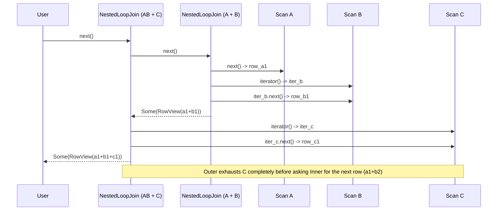

# Join Execution Flow

This document explains the architecture and execution flow of join operations in `relop`.

## Structural Representation

Joins in `relop` are implemented using a **Nested Loop Join** strategy. For multi-table joins, 
the parser and planner construct a recursive, **left-deep tree** structure.

For example, a query with `FROM A JOIN B JOIN C` is represented as:

### Logical Plan Structure
```text
LogicalPlan::Join (Outer)
 ├─ Left:  LogicalPlan::Join (Inner)
 │          ├─ Left:  LogicalPlan::Scan (A)
 │          └─ Right: LogicalPlan::Scan (B)
 │          └─ Condition: ON (A.x = B.y)
 ├─ Right: LogicalPlan::Scan (C)
 └─ Condition: ON (Inner.z = C.w)
```

### Executor Structure
The `execute_select` method recursively builds a tree of `ResultSet` implementations. Each `NestedLoopJoinResultSet` treats its left child as a stream of already-joined rows and its right child as a source to restart for every left row.

```text
NestedLoopJoinResultSet (Outer)
 ├─ left:  NestedLoopJoinResultSet (Inner)
 │          ├─ left:  ScanResultsSet (A)
 │          └─ right: ScanResultsSet (B)
 └─ right: ScanResultsSet (C)
```

## Iterator Execution Flow

Execution is demand-driven (Volcano model). When the root `ResultSet` is asked for the `next()` row:

1.  **Pull Left:** The outer Join pulls a row from its `left` child. If the `left` child is another Join, it recursively pulls from its own children until a physical `Scan` provides a row.
2.  **Initialize Right:** Once a left row is obtained, the outer Join opens a **brand new iterator** for its `right` child.
3.  **Nested Loop:** The outer Join iterates through the `right` child. For each pair:
    *   It evaluates the `ON` condition.
    *   If it matches, it calls `RowView::merge` to create a single physical `Row`.
    *   It wraps this `Row` in a `RowView` and returns it.
4.  **Repeat:** Once the `right` iterator is exhausted, the outer Join pulls the *next* row from the `left` child and restarts the `right` iterator.

### Data Flow Visualization


